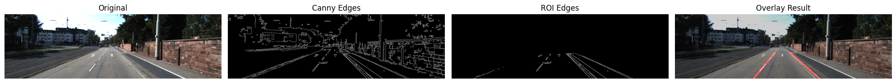
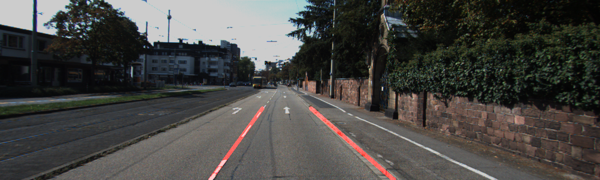

# Lane Detection using OpenCV on KITTI

## Overview
This project implements a classical computer vision pipeline for road and lane-related scene analysis using the KITTI road dataset. The system processes road images with OpenCV and applies a sequence of image processing steps to detect lane-like boundaries and overlay them on the original image.

The project was developed as a learning-oriented computer vision project to understand how classical image processing techniques can be applied to autonomous driving scenes.

## Objectives
The main objectives of this project are:

- understand the basics of image processing with OpenCV
- build a complete lane detection pipeline step by step
- apply the pipeline to KITTI road images
- support both single-image and batch processing
- save intermediate outputs for analysis and debugging
- create a portfolio-ready autonomous driving computer vision project

## Dataset
This project uses the **KITTI Road Dataset**, which is part of the KITTI Vision Benchmark Suite.

Why KITTI was chosen:
- recorded in Germany
- relevant to autonomous driving
- suitable for road and lane-related scene analysis
- manageable for a first OpenCV-based project

## Method

The lane detection pipeline consists of the following steps:

1. **Image Loading**  
   Read an image from the KITTI dataset.

2. **Grayscale Conversion**  
   Convert the color image into grayscale to simplify processing.

3. **Gaussian Blur**  
   Reduce noise before edge detection.

4. **Canny Edge Detection**  
   Detect strong edges in the image.

5. **Region of Interest (ROI)**  
   Keep only the road-relevant region and ignore unnecessary parts of the scene.

6. **Hough Line Transform**  
   Detect line segments from the ROI edge image.

7. **Slope Filtering**  
   Remove nearly horizontal or irrelevant lines.

8. **Left/Right Line Separation**  
   Group line segments into left-side and right-side candidates.

9. **Line Averaging**  
   Compute one representative line for the left side and one for the right side.

10. **Overlay Generation**  
    Draw detected lines and blend them with the original image.

## Features

This project currently supports:

- single image processing
- batch image processing from a folder
- optional visualization with `--show`
- saving final overlay results
- saving intermediate outputs:
  - grayscale
  - blur
  - edges
  - ROI edges
- saving comparison figures
- saving batch summary CSV
- terminal summary of detection results

## Project Structure

```bash
lane-detection-opencv/
├── assets/
│   └── results/
├── data_road/
├── output/
├── main.py
├── utils.py
├── requirements.txt
├── .gitignore
└── README.md
```

## Installation

### 1. Create a Conda environment

```bash
conda create -n lane_cv python=3.12 -y
conda activate lane_cv
```
### 2. Install dependencies

```bash
pip install -r requirements.txt
```
## Usage

### Run on a single image

```bash
python main.py --image data_road/training/image_2/um_000001.png --output output/result_1.png
```
### Run on a single image with visualization

```bash
python main.py --image data_road/training/image_2/um_000001.png --output output/result_1.png --show
```
### Run batch processing on a folder

```bash
python main.py --image data_road/training/image_2 --output output/batch_results --limit 3
```
### Run batch processing with visualization

```bash
python main.py --image data_road/training/image_2 --output output/batch_results --limit 3 --show
```

## Results

The following examples show the intermediate and final outputs of the lane detection pipeline on KITTI road images.

### Comparison View

This figure shows the original image, detected edges, ROI-filtered edges, and the final overlay result.



### Final Lane Overlay

This figure shows the final detected lane lines blended with the original road image.



## Limitations

This project uses a classical computer vision approach, so it has some limitations:

- sensitive to ROI design
- sensitive to shadows and lighting changes
- may fail when lane boundaries are weak or unclear
- may detect only one side in some scenes
- does not use semantic understanding
- does not handle curved lanes robustly

## Learning Outcomes

Through this project, the following concepts were practiced:

- OpenCV image processing
- grayscale conversion
- Gaussian smoothing
- edge detection
- masking and ROI selection
- Hough transform
- slope-based filtering
- batch image processing
- result saving and project structuring

## Future Work

Possible future improvements include:

- improving the ROI design for better left-lane detection
- adding configurable pipeline parameters from the command line
- processing video instead of only images
- comparing classical OpenCV results with deep learning methods
- adding evaluation metrics against road/lane annotations
- creating a gallery view for multiple processed results
- supporting more robust lane detection under difficult lighting conditions

## Conclusion

This project demonstrates how a complete lane detection pipeline can be built using classical computer vision techniques and applied to autonomous driving images from the KITTI dataset. It serves as a strong beginner-to-intermediate OpenCV project and provides a practical foundation for more advanced perception systems.

## Author

**Arefin Aziz Sifat**  
Master’s Student in AI Engineering of Autonomous Systems  
Technische Hochschule Ingolstadt
